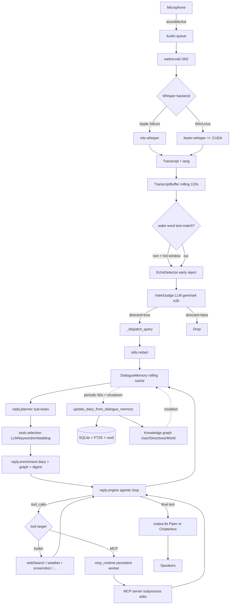

# Jarvis — Architecture Notes

Cartographie figée du dépôt à un instant T. Aucune modification de source.
Branche : `claude/nice-khayyam-d5b235` (worktree). Defaults branch : `develop`.

---

## 1. Vue d'ensemble

Jarvis est un assistant vocal 100 % local. Le coeur (`src/jarvis/`) est un
process *daemon* indépendant ; un *desktop_app* PyQt6 (`src/desktop_app/`) le
pilote en sous-processus et fournit tray icon, fenêtres et IPC stdin/stdout.
La règle invariante : le coeur ignore l'existence du desktop_app.

### Cartographie `src/jarvis/`

| Module | Rôle (1-2 lignes) |
|---|---|
| `main.py` | Trivial entrypoint → `daemon.main()`. |
| `daemon.py` | Orchestrateur du process. Charge config, DB, mémoire, MCP, TTS, lance le `VoiceListener` thread, gère la boucle diary périodique et le shutdown propre. |
| `config.py` | `Settings` dataclass + `load_settings()` lisant `~/.config/jarvis/config.json`. Source unique des modèles supportés (`SUPPORTED_CHAT_MODELS`). |
| `system_prompt.py` | Template unique de la persona (butler britannique). `build_system_prompt(name)` rend le wake-word capitalisé. |
| `llm.py` | Wrappers HTTP Ollama : `call_llm_direct`, `call_llm_streaming`, `chat_with_messages` (tool API native), `ToolsNotSupportedError`. |
| `debug.py` | `debug_log(msg, category)` central. |
| `listening/` | Pipeline audio → texte → intent. Voir §2. |
| `dictation/` | Hold-to-dictate (hotkey global), partage le modèle Whisper du listener. |
| `reply/` | Génération de réponse : planner, engine agentic, enrichment, prompts. Voir §2. |
| `tools/` | Registry des tools builtin + MCP, sélection (LLM/keyword/embedding/all). |
| `tools/builtin/` | Outils internes : `webSearch`, `fetchWebPage`, `screenshot`, `localFiles`, `getWeather`, `logMeal`/`fetchMeals`/`deleteMeal`, `refreshMCPTools`, `stop`, `toolSearchTool`. |
| `tools/external/` | `MCPClient` (stdio MCP) + `mcp_runtime` (event-loop persistant, une worker-task par serveur, retry sur `MCPServerSessionError`). |
| `memory/db.py` | SQLite (WAL) + FTS5 sur `conversation_summaries` + VSS optionnel (vec FLOAT[768]). |
| `memory/conversation.py` | `DialogueMemory` (rolling cache + warm profile invalidation + tool-carryover) ; pipeline diary (résumé + scrub déflection + reembed). |
| `memory/graph.py` | Knowledge graph auto-organisé (`User`/`Directives`/`World`), mutation listeners. |
| `memory/graph_ops.py` | Opérations CRUD/refactor sur le graphe. |
| `memory/embeddings.py` | `get_embedding()` Ollama. |
| `memory/recall_gate.py` | Skip enrichissement déterministe si fenêtre chaude couvre la question. |
| `output/tts.py` | Factory + engines TTS : Piper (default, auto-download HuggingFace) et Chatterbox (clone vocal). |
| `output/tune_player.py` | Tonalité « thinking ». |
| `utils/redact.py` | Auto-redaction (email, cartes, AWS/Stripe/GH/OpenAI/Google keys, JWT, etc.). |
| `utils/location.py` | GeoLite2 local + chaîne UPnP / socket / OpenDNS. |
| `utils/time_context.py` | Contexte temporel injecté dans le system prompt. |
| `utils/vector_store.py` + `fast_vector_store.py` | Vector stores (faiss-cpu). |
| `utils/fuzzy_search.py` | Génération de requêtes FTS5 flexibles. |

`desktop_app/` (PyQt6) : tray, setup wizard, settings auto-générées, memory viewer, dictation history, face widget, splash, updater. Communique via stdin/stdout (`__DIARY__:`) avec le daemon.

---

## 2. Composants critiques (qui fait quoi)

### Appels au LLM (Ollama)
- **Couche basse** : `src/jarvis/llm.py` (`call_llm_direct`, `call_llm_streaming`, `chat_with_messages`). Toutes les requêtes passent par `POST {ollama_base_url}/api/chat`. Le `num_ctx` est à 4096 par défaut, 8192 pour la boucle agentic.
- **Boucle agentic principale** : [`src/jarvis/reply/engine.py:776`](src/jarvis/reply/engine.py:776) (`run_reply_engine`). Construit le system prompt, sélectionne les tools, lance le planner, itère les tool_calls.
- **Résolveur de modèle pour le router/planner** : [`resolve_tool_router_model`](src/jarvis/reply/engine.py:148) — chaîne `tool_router_model` → `intent_judge_model` → `ollama_chat_model`.
- **Intent voice** : [`src/jarvis/listening/intent_judge.py`](src/jarvis/listening/intent_judge.py) (`gemma4:e2b` par défaut, toujours chargé).
- **Planner** : [`src/jarvis/reply/planner.py`](src/jarvis/reply/planner.py) (pré-loop décomposition + direct-exec pour petits modèles).
- **Digests** : `digest_memory_for_query`, `digest_tool_result_for_query`, `digest_loop_for_max_turns` dans [`src/jarvis/reply/enrichment.py`](src/jarvis/reply/enrichment.py).
- **Diary summariser + deflection rewrite** : [`src/jarvis/memory/conversation.py`](src/jarvis/memory/conversation.py).
- **Catalogue exhaustif** : `docs/llm_contexts.md` (référence canonique, à tenir à jour).

### Wake word + STT
- **Wake word** : pas de Porcupine ni openWakeWord — détection **texte** sur les transcriptions Whisper via fuzzy matching (difflib + alias) dans [`src/jarvis/listening/wake_detection.py`](src/jarvis/listening/wake_detection.py:9). La doc README mentionne « openWakeWord » mais le code actuel n'utilise que Whisper + intent judge LLM.
- **STT** : `faster-whisper` sur Windows/Linux, `mlx-whisper` sur Apple Silicon. Sélection dans [`src/jarvis/listening/listener.py`](src/jarvis/listening/listener.py:247). Probe CUDA (cuBLAS/cuDNN) sur Windows.
- **Pipeline audio** : `sounddevice` capture → `webrtcvad` VAD → `WhisperModel.transcribe()` → garde anti-hallucination (`whisper_min_confidence`, `whisper_no_speech_threshold`) → `EchoDetector` + `IntentJudge` LLM → `_dispatch_query` → `run_reply_engine`.
- **Hot window** + **echo detection** : [`echo_detection.py`](src/jarvis/listening/echo_detection.py), [`state_manager.py`](src/jarvis/listening/state_manager.py), [`transcript_buffer.py`](src/jarvis/listening/transcript_buffer.py).

### Orchestration des conversations
- **State machine voix** : [`StateManager`](src/jarvis/listening/state_manager.py) (états `LISTENING`/`COLLECTING`/`HOT_WINDOW`).
- **Contexte rolling** : [`DialogueMemory`](src/jarvis/memory/conversation.py) — inactivity timeout (`dialogue_memory_timeout`), max 20 interactions, warm-profile cache invalidé via listeners de mutation du graphe (`register_graph_mutation_listener`).
- **Personnalités/profils** : un seul system prompt unifié dans `system_prompt.py`. La spec `reply.spec.md` précise « tools return raw data; profiles handle formatting » — la personnalité s'adapte au topic via instructions (surgical/pragmatic/encouraging) dans le même prompt, pas via fichiers de profil multiples.
- **Boucle de réponse** : [`run_reply_engine`](src/jarvis/reply/engine.py:776) → planner → router → enrichment (diary + graph + digest) → `chat_with_messages` (tools natifs ou text-tool-call parsing pour Gemma).

### MCP servers (chargement + exécution)
- **Discovery au boot** : [`initialize_mcp_tools`](src/jarvis/tools/registry.py:50) lit `cfg.mcps` et appelle `discover_mcp_tools` ; cache global `_mcp_tools_cache`.
- **Client stdio MCP** : [`MCPClient`](src/jarvis/tools/external/mcp_client.py) (SDK `mcp==1.13.1`). Résolution PATH étendue (Homebrew, nvm, fnm, Volta).
- **Runtime persistant** : [`_PersistentMCPRuntime`](src/jarvis/tools/external/mcp_runtime.py:77) — un event-loop asyncio + une worker-task par serveur, files d'attente, retry sur `MCPServerSessionError`, `idle_timeout_sec` opt-in pour stateless. Clé : *sessions stdio long-lived* pour que Chrome (chrome-devtools-mcp) survive aux tool calls.
- **Refresh à la nouvelle conversation** : `refresh_mcp_tools()` dans le hot path de `run_reply_engine`.

### TTS (Piper / Chatterbox)
- **Factory** : [`create_tts_engine`](src/jarvis/output/tts.py) — sélection sur `cfg.tts_engine` (`"piper"` default, `"chatterbox"`).
- **Piper** : auto-download depuis `huggingface.co/rhasspy/piper-voices` (`en_GB-alan-medium` par défaut, ~60MB). Subprocess natif `piper`.
- **Chatterbox** : `chatterbox-tts==0.1.2`, supporte voice cloning (`tts_chatterbox_audio_prompt`).
- **Tracking** : `track_tts_start`/`activate_hot_window` couplés à `EchoDetector` pour ne pas s'écouter parler.

### Mémoire SQLite + FTS5 + auto-redaction
- **DB** : [`Database`](src/jarvis/memory/db.py:93) — SQLite `~/.local/share/jarvis/jarvis.db`, WAL, `synchronous=NORMAL`. Tables : `meals`, `conversation_summaries`. FTS5 virtual table `summaries_fts` (porter tokenizer) avec triggers `ai`/`ad`/`au`. Vecteurs : `vss0` virtual table optionnelle (`embeddings` FLOAT[768]) + `summary_vec`.
- **Auto-redaction** : [`utils/redact.py`](src/jarvis/utils/redact.py) — regex ordonnées (vendor-specific avant génériques) couvrant email, cartes, AWS/Stripe/GH/OpenAI/Google/JWT, headers Authorization, mots-clés password/secret/token/refresh_token/session, OTP. Appelée à chaque entrée user dans `run_reply_engine` ([`engine.py:798`](src/jarvis/reply/engine.py:798)) et avant écriture dans diary/graph.
- **Knowledge graph** : [`memory/graph.py`](src/jarvis/memory/graph.py) — auto-split par topic, branches `User`/`Directives`/`World`, mutation listeners. Migration legacy au boot du daemon.

---

## 3. Extension points propres

### Router LLM hybride (local/cloud)
- **Endroit unique** : [`src/jarvis/llm.py`](src/jarvis/llm.py). Toute la stack passe par `chat_with_messages` / `call_llm_direct` / `call_llm_streaming`. Brancher un router au niveau de ces trois fonctions (ou introduire un `LLMBackend` abstrait dans `llm.py`) propage automatiquement à tous les contextes (`docs/llm_contexts.md`).
- Le `Settings` (`config.py`) attend déjà `ollama_base_url` + `ollama_chat_model` + variants spécialisés (`intent_judge_model`, `tool_router_model`, `planner_model`). Ajouter `chat_model_provider` / `cloud_fallback_*` et router par classe de tâche (intent/router/planner/digest/main) est la voie naturelle.
- Garde-fou privacy : le router doit lire un flag explicite — la promesse 100 % local est un *core selling point* (`CLAUDE.md` : « Data privacy comes first, always »).

### Interface texte parallèle à la voix
- `run_reply_engine` est déjà découplé de l'audio : il prend `text: str` + `dialogue_memory` + `language`. Le `Settings` expose `cfg.use_stdin` (utilisé pour l'attribut `source_app` du diary, [`daemon.py:229`](src/jarvis/daemon.py:229)).
- **Endroit propre** : ajouter un thread serveur (Flask déjà dans `requirements.txt`) ou un mode CLI dans `daemon.py` qui pousse vers `_global_dialogue_memory` et appelle `run_reply_engine` directement. Pas besoin de toucher engine/planner/tools.
- Issue connue : [#35](https://github.com/isair/jarvis/issues/35) — « text chat interface » est sur la roadmap.

### Nouveaux MCP servers custom
- Voie utilisateur : ajouter un objet dans `cfg.mcps` (config.json) — `command`, `args`, `env`, optionnel `idle_timeout_sec`. `initialize_mcp_tools` les découvre au boot, `refresh_mcp_tools` à chaque nouvelle conversation.
- Voie développeur : un serveur MCP custom *en process* (sans subprocess stdio) demanderait d'étendre `MCPClient` ou de bypasser `_PersistentMCPRuntime`. Plus simple : packager le serveur en CLI MCP standard et l'ajouter à `cfg.mcps`.
- Pour étendre **builtin** tools plutôt que MCP : ajouter dans `tools/builtin/`, enregistrer dans `BUILTIN_TOOLS` ([`registry.py:30`](src/jarvis/tools/registry.py:30)), écrire un `*.spec.md` à côté (cf. `web_search.spec.md`, `log_meal.spec.md`).

---

## 4. Tests (`pytest`)

L'environnement local n'a que **Python 3.9** ; le projet utilise PEP 604 (`str | None`) en annotations *évaluées* (dataclass `Settings`) sans `from __future__ import annotations`, ce qui force Python 3.10+.

Résultat de `python3 -m pytest --collect-only -q` :
- **403 tests collectés** (sur ~73 fichiers `test_*.py`).
- **60 erreurs de collection** (toutes : `TypeError: unsupported operand type(s) for |: 'type' and 'NoneType'`, à `config.py:73`).
- Tests *runnable* : aucun ne passe car presque toute la suite importe `jarvis.config` directement ou transitivement (l'erreur cascade).
- Coverage : **non mesurée** (échec de collection).

Pour exécuter la suite localement il faut installer un Python ≥ 3.10 (le projet vise une mamba env, `CLAUDE.md` cite `micromamba activate .mamba_env`).

---

## 5. Dépendances Python clés (`requirements.txt`)

| Catégorie | Paquets |
|---|---|
| LLM HTTP | `requests==2.32.3` (Ollama est externe, pas un paquet pip) |
| STT | `faster-whisper==1.0.3`, `mlx-whisper>=0.4.0` (Apple Silicon), `nvidia-cublas-cu12` + `nvidia-cudnn-cu12` (Windows GPU) |
| Audio | `sounddevice==0.4.7`, `webrtcvad==2.0.10` |
| TTS | `piper-tts>=1.3.0`, `chatterbox-tts==0.1.2`, `pygame>=2.1.0` |
| MCP | `mcp==1.13.1` |
| Web / scraping | `beautifulsoup4`, `lxml`, `html2text`, `playwright>=1.40.0` |
| OCR / images | `pytesseract==0.3.13`, `Pillow==10.4.0` |
| Hotkey | `pynput>=1.7.6` |
| Géo / réseau | `geoip2==4.8.0`, `miniupnpc==2.2.8` |
| Vecteurs | `faiss-cpu>=1.7.4`, `numpy<2.0.0` |
| Texte | `rapidfuzz==3.6.1` |
| Server | `flask>=3.0.0` (présent mais peu utilisé — disponible pour une interface texte) |
| Desktop | `PyQt6>=6.6.0`, `PyQt6-WebEngine`, `psutil`, `pyinstaller>=6.13.0` |
| Tests | `pytest==8.3.2`, `pytest-repeat==0.9.3` |
| Config | `python-dotenv==1.0.1` |

---

## 6. Flux principal voix → réponse (diagramme)

---

## 7. Pièges et notes

- **Wake word** : le README mentionne « openWakeWord » dans le subtitle, mais le code ne contient ni Porcupine ni openWakeWord. La détection est texte-only sur les sorties Whisper (`wake_detection.py`). Tout travail audio-level wake-word reste à faire.
- **Spec files** : `CLAUDE.md` impose de chercher les `*.spec.md` avant tout changement. Liste maintenue dans `CLAUDE.md` §Spec File Registry. Le graphe des LLM contexts est dans `docs/llm_contexts.md` (à tenir synchro).
- **British English** + pas d'em dash dans les écrits user-facing (`CLAUDE.md`).
- **Tests** : exigent Python 3.10+. L'env local (3.9) ne peut rien exécuter sans mamba env.
- **Privacy** : redaction systématique à l'entrée, pas de cloud par défaut, GeoLite2 local, MCP stdio uniquement.

---

## UI Reconnaissance (Phase 0 - Orb)

### Desktop app PyQt6 — entry et windows
- **Entry** : `python -m desktop_app` → [src/desktop_app/__main__.py:6](src/desktop_app/__main__.py:6) → `desktop_app.main()` → `app.py::main()` ([app.py:2255](src/desktop_app/app.py:2255)) qui instancie `QApplication(sys.argv)` ([app.py:1250](src/desktop_app/app.py:1250)).
- **Architecture des windows** : tout est `QWidget` ou `QMainWindow` ad hoc, pas de framework custom. La `FaceWindow` ([face_widget.py:1046](src/desktop_app/face_widget.py:1046)) est un `QWidget` floating top-on `WindowStaysOnTopHint`, position right-side, contient un `LowPolyFaceWidget` peint via `QPainter` 30 FPS (`QTimer.start(33)` à [face_widget.py:238](src/desktop_app/face_widget.py:238)). La `SettingsWindow` ([settings_window.py](src/desktop_app/settings_window.py)) est auto-générée depuis config.
- **Memory Viewer est un Flask serveur, pas une fenêtre Qt** ([memory_viewer.py:23](src/desktop_app/memory_viewer.py:23)). Ouvert dans le browser système. Architecture différente, à ne pas confondre avec l'orb cible.
- **PyQt6 version** : `PyQt6>=6.6.0` + `PyQt6-WebEngine>=6.6.0` (requirements.txt). Note : `src/desktop_app/CLAUDE.md` impose l'usage de `themes.py` partagé.

### State bus daemon → UI — DÉJÀ EN PLACE
- Pas de hook à inventer : [face_widget.py:75-150](src/desktop_app/face_widget.py:75) contient `JarvisStateManager(QObject)`, singleton accédé via `get_jarvis_state()`.
- **Enum `JarvisState`** ([face_widget.py:54](src/desktop_app/face_widget.py:54)) : `ASLEEP`, `IDLE`, `LISTENING`, `THINKING`, `SPEAKING`, `DICTATING`, `DICTATION_PROCESSING`. Couvre 5/5 des états demandés (pas d'`ERROR` distinct — à ajouter si l'orb doit le visualiser, ou réutiliser ASLEEP avec un flag séparé).
- **Double mécanisme** : (a) signal Qt `state_changed.emit(value)` pour les consumers in-process, (b) file `/tmp/jarvis_state` ([face_widget.py:70](src/desktop_app/face_widget.py:70)) lue/écrite à chaque set pour cross-process (daemon subprocess ↔ desktop app).
- **Call sites du setter** déjà câblés : listener.py:459/473/2165, reply/engine.py:2139, output/tts.py:594/953, listener.py:1178. L'orb consomme via `get_jarvis_state().state_changed.connect(callback)` + polling `state_manager.state` au timer tick.

### Tap point audio INPUT (mic, avant Whisper)
- **Stream** : `sd.InputStream` ouvert à [listener.py:2045](src/jarvis/listening/listener.py:2045). Paramètres : `samplerate=cfg.sample_rate (default 16000)`, `channels=1`, `dtype="float32"`, `blocksize=frame_samples` (≈480 = 30ms à 16kHz). Fallback native rate si le device refuse 16k.
- **Callback** : `_on_audio(indata, frames, time_info, status)` à [listener.py:1422](src/jarvis/listening/listener.py:1422). `indata` = numpy float32 mono. Le chunk est push dans `_audio_q: queue.Queue(maxsize=64)`. Le callback est pauseable via `_should_stop` / `_dictation_active`.
- **Hook pour RMS 60 FPS** : option (a) recommandée — ajouter un side-effect non-bloquant dans `_on_audio` (sample 1 chunk sur ~2 pour 30→60 FPS, calcul `np.sqrt(np.mean(indata**2))`, push dans une `queue.Queue(maxsize=1)` consommée côté UI). Option (b) inacceptable : ouvrir un second `InputStream` parallèle prend le micro en exclusif sur certains drivers macOS.
- À 16 kHz le frame du callback est ~30ms. Pour 60 FPS animation, faire le RMS à chaque callback suffit largement (l'UI sample 16ms sur sa queue).

### Tap point audio OUTPUT (TTS playback)
- **Piper** (default) : `sd.OutputStream` callback à [tts.py:881](src/jarvis/output/tts.py:881), `audio_callback(outdata, frames, time_info, status)`. `outdata` = buffer envoyé aux speakers (int16 mono à `self._sample_rate`, typiquement 22050 Hz). C'est ÉCRIT par Jarvis, donc on a la donnée brute sortie. **Tap = ajouter un side-effect read-only sur `outdata` avant `return` du callback** : RMS, push dans queue, l'orb consomme.
- **Chatterbox** : passe par `pygame.mixer.music.play()` à [tts.py:546](src/jarvis/output/tts.py:546). pygame ne donne pas de callback par-frame → pas tappable au niveau buffer sans monkey-patch ou wrap. Pour Phase 1, traiter chatterbox comme "non accessible, à wrapper plus tard" (lookup table d'amplitude synthétique pilotée par l'état `SPEAKING` comme fait actuellement le mouth waveform).
- **Path simple Phase 1** : tapper Piper uniquement (default voice path), garder Chatterbox sur une enveloppe synthétique. 95% des users sont sur Piper.

### Deps à ajouter (requirements.txt)
- **Présents déjà** : `PyQt6>=6.6.0`, `PyQt6-WebEngine>=6.6.0`, `numpy<2.0.0`, `scipy>=1.x` (transitif via librosa, version installée 1.17.1).
- **À ajouter** : `moderngl>=5.10` (GL context Python pour shaders custom, indépendant de Qt's OpenGL), `pyrr>=0.10` (matrices 3D si l'orb a une perspective ou rotation — sinon numpy suffit). `scipy.fft` déjà couvert par scipy installé.
- **Optionnel** : `moderngl-window` si on veut un context standalone, mais l'orb sera dans une `QOpenGLWidget` PyQt6 (déjà fourni) → moderngl pur suffit.
- **Pas nécessaire** : `glm` (Python glm wrapper) — redondant avec pyrr/numpy. `pyglet`/`glfw` — Qt fournit déjà le context.

---

## Phase 2 Reconnaissance

Phase 0 du sprint Phase 2. Lecture seule, branche `feature/orb-as-primary`
(merge `feature/hybrid-llm-router` + `feature/reactive-orb-ui` sur `de93d67`).
Recon ciblée sur 5 points + encart "Mode Hybride". Aucune modif code applicatif.

### 1. Instanciation face actuelle

- `LowPolyFaceWidget` défini à [face_widget.py:153](src/desktop_app/face_widget.py:153), instancié sans condition dans `FaceWindow.__init__` à [face_widget.py:1069](src/desktop_app/face_widget.py:1069). `FaceWindow` = `QWidget` standalone à [face_widget.py:1046](src/desktop_app/face_widget.py:1046), window flag `WindowStaysOnTopHint`.
- `FaceWindow` importé à [app.py:65](src/desktop_app/app.py:65), instancié toujours à [app.py:1273](src/desktop_app/app.py:1273) (build inconditionnel — seul l'affichage est gaté).
- **Aucun mécanisme "choix de face" en config**. Décision actuelle 100% CLI flag :
  - Orb shown by default à [app.py:2663](src/desktop_app/app.py:2663) → `if "--no-orb" not in sys.argv: OrbWindow().show_orb()` ([app.py:2665-2667](src/desktop_app/app.py:2665))
  - `FaceWindow.show()` gaté inverse à [app.py:1906](src/desktop_app/app.py:1906) → `if "--no-orb" in sys.argv: self.face_window.show()`
- Tests existants : [tests/test_face_widget.py](tests/test_face_widget.py) (positioning only, pas de choix), [tests/orb/test_orb_window.py](tests/orb/test_orb_window.py) (instanciation + hotkey guard).
- **Phase 2A**: ajouter `ui.face: "orb"|"lowpoly"` dans config + sélecteur dans `app.py` qui remplace les deux flags-checks par une seule décision basée sur cfg. Préserver `--no-orb` comme override CLI pour CI.

### 2. Pipeline français

- Whisper default `"medium"` ([config.py:478](src/jarvis/config.py:478), parsing [config.py:695](src/jarvis/config.py:695)) — modèle multilingue. Les `.en` sont EN-only mais ne sont pas le default. ✅
- Auto-detect activé : `language=None` passé à `mlx_whisper.transcribe` ([listener.py:2366](src/jarvis/listening/listener.py:2366)) et `model.transcribe` (faster-whisper, [listener.py:2418, :2423](src/jarvis/listening/listener.py:2418)). Langue détectée stockée dans `_last_detected_language` ([listener.py:2373](src/jarvis/listening/listener.py:2373), :2430), consommée par les tools FR (Wikipedia FR locale).
- Voix Piper : scalaire `tts_piper_model_path` ([config.py:455](src/jarvis/config.py:455) default `None`, parsing [config.py:675-685](src/jarvis/config.py:675)). **Pas de mécanisme "voix par langue détectée"**. À refacto Phase 2B : `tts_voices: {en: ..., fr: ...}` + sélecteur dans `tts.py` qui lit `_last_detected_language`.
- System prompt + cloud : `build_system_prompt(_assistant_name, response_language="français")` à [engine.py:1419](src/jarvis/reply/engine.py:1419) → primacy + recency + native French tail à [system_prompt.py:121-156](src/jarvis/system_prompt.py:121). Passé via `messages[0]` à `chat_with_messages` → `anthropic_provider` extrait le system block ([anthropic_provider.py:518-533](src/jarvis/providers/anthropic_provider.py:518)) et l'envoie au cloud via `system=system_blocks`. ✅ La directive FR atteint Sonnet identiquement au local.
- ⚠️ **Bloquant unique** : [engine.py:1430-1434](src/jarvis/reply/engine.py:1430) ajoute *inconditionnellement* `"Always respond in English regardless of the language the user speaks in."` quand `tts_engine in ('piper', 'chatterbox')`. La contrainte ignore `response_language` et entre en conflit avec la directive FR. Sonnet l'override en pratique (persona prompt FR plus fort), mais gemma4:e2b peut flipper. **Phase 2B fix** : gater par `response_language == "" and _last_detected_language in (None, "en")`.
- ❌ Non bloquant (vérifié) : `_REWRITE_DEFLECTION_SYSTEM_PROMPT` à [conversation.py:36](src/jarvis/memory/conversation.py:36) est en EN MAIS explicitement multilingue par design (line 56: "This task applies in every language. Do NOT translate the output"). Pas une régression FR.

### 3. Audio bus actuel

- `AudioBus` à [audio_bus.py:217](src/desktop_app/orb/audio_bus.py:217) : ring buffer numpy 1s @ 22050 Hz, FFT 512-pt, EMA α=0.3, bandes bass(0-250) / mid(250-2000) / high(2000+). `push()` et `read_bands()` lock-serialised, ~µs.
- Observer registry sur le listener : [listener.py:34-58](src/jarvis/listening/listener.py:34) expose `register_audio_observer(fn)` / `unregister_audio_observer(fn)`, hook firing à [listener.py:1463](src/jarvis/listening/listener.py:1463) (try/except per observer, jamais bloquant pour STT).
- **L'"audio synthétique" Phase 1 = aucune source en réalité** : `register_audio_observer` n'est jamais appelé dans `app.py` ni `run_orb_standalone.py`. `OrbWidget.paintEvent` ([orb_widget.py:147](src/desktop_app/orb/orb_widget.py:147)) lit `audio_bus.read_bands()` qui renvoie `BandReading.zero()`. La motion visible vient du shader temporel `sin(t*1.2 + phase)` à [orb_widget.py:240-242](src/desktop_app/orb/orb_widget.py:240).
- **Branchement audio réel — options Phase 2C** :
  - *In-process* (standalone) : une ligne `register_audio_observer(audio_bus.push)`. Coût zéro. Mais le path bundled-mode du desktop_app fork un subprocess pour le daemon — out-of-process.
  - *Cross-process — `multiprocessing.shared_memory`* : ring buffer 16 KB = 250ms @ 16kHz mono f32 (16000 × 4 = 64 KB/s → 4096 samples). Producer écrit ~30ms chunks (1920 bytes) au callback rate du listener. Consumer lit 512 samples (2 KB) à 60 Hz. Overhead estimé ~1-5 µs/op via numpy memmap + atomic write-counter. Lockless (1 writer / 1 reader).
  - *Cross-process — `multiprocessing.Queue`* : ~10-50 µs/push (pickle), suffisant à 30 chunks/s mais pas zero-copy.
  - *UNIX socket / pipe* : trop de boilerplate vs `shared_memory`.

### 4. macOS LaunchAgent

- **Aucun fichier `.plist`** dans le repo (find: 0 hits). Aucune mention auto-start dans `README.md` ni `docs/`.
- **Aucun bundle identifier** convention dans le code (grep `com.jarvis|org.jarvis|com.isair` → 0 hits).
- **Aucun LaunchAgent installé** : `~/Library/LaunchAgents/` ne contient rien de jarvis.
- À créer ex-nihilo Phase 2E. Conventions proposées :
  - Bundle id : `com.jarvis.daemon` (cf. spec utilisateur).
  - Chemin : `~/Library/LaunchAgents/com.jarvis.daemon.plist`.
  - Logs : `~/Library/Logs/jarvis/{stdout,stderr}.log` (un dossier existe déjà à `~/Library/Logs/Jarvis/` avec `.crash_marker` — réutiliser).
  - **ANTHROPIC_API_KEY** : la clé est sensible → JAMAIS en clair dans le `.plist` (lisible via `launchctl print`). **Option A recommandée** : `security add-generic-password -s jarvis-anthropic -a "$USER"` + wrapper bash dans `<ProgramArguments>` qui fait `security find-generic-password -w -s jarvis-anthropic` et l'exporte avant `python -m jarvis.main`. **Option B fallback** : référencer `~/.config/jarvis/.env` sourcé par le wrapper. Sans cette gestion, le daemon auto-launched passe en `local_fallback` (clé absente de l'env) — pattern déjà observé dans `llm_router_stats` à 19:06 (rows `local_fallback claude-sonnet-4-6 simple_query`).

### 5. Scope Phase 2 — viabilité + risques

- **Pourquoi orb pas default upstream ?** Aucun blocker technique : c'est un choix produit conservateur (`FaceWindow` est l'identité visuelle historique). Phase 1 le proposait via `--with-orb` opt-in ; ta branche perso l'a inversé en `--no-orb` opt-out. Phase 2A consolide via config.
- **Phase 2B faisable 100% en config ?** **NON**. Trois modifs code minimum :
  1. [engine.py:1430-1434](src/jarvis/reply/engine.py:1430) — gater la contrainte EN par `response_language` + langue détectée.
  2. `tts_voices` per-language map dans `config.py` + sélecteur dans `tts.py` lisant `_last_detected_language`.
  3. Optionnel : per-provider prompt si A/B montre divergence (cf. spec Phase 2B point 3 — STOP avant impl).
- **Régressions anglophones si Whisper default change ?** **Aucune** : default `medium` est déjà multilingue + auto-detect. Phase 2B point 1 ("default vers `large-v3-turbo`") est en réalité optionnel — gain qualité FR vs coût RAM. À documenter, pas à imposer.
- **Impact hybride sur qualité FR** : Sonnet 4.6 nettement supérieur à `gemma4:e2b` en FR (constaté tests live 1:01 AM, réponse `multi_step_reasoning` 26/597 tokens cohérente). Avec `cloud_intents` étendu à 4 (incluant `simple_query`), majorité des turns FR utiles partent au cloud. Mesure A/B prévue Phase 2B via `scripts/test_french_quality.py`.
- **Coût mensuel projeté** : pricing `claude-sonnet-4-6` $3/1M in, $15/1M out ([pricing.py:9](src/jarvis/providers/pricing.py:9)).
  - Usage typique perso : ~50 turns/j → ~80% partent au cloud (4 intents éligibles).
  - Moyenne ~800 in + 200 out par turn cloud (persona ~5KB + memory + question + réponse courte).
  - Daily : 40 turns × (800 in + 200 out) = 32K in + 8K out → $0.10 + $0.12 = **~$0.22/j**.
  - Mensuel : **~$7/mois** sans cache. Avec prompt cache 90% hit sur le persona system prompt (8KB stable, cache threshold = 8000 chars activé dans la config) → input divisé par ~5 → **~$3-4/mois**. Largement sous le seuil $2 de "tests Phase 2" (la spec parle de la phase, pas du mois).

### Mode Hybride — implications observées

- **Phase 2A** (face widget choice) : aucune interaction avec le router. Sélection orb/lowpoly = widget Qt, jamais touchée par les LLM calls. Implémentable + testable sans risque cloud.
- **Phase 2B** (qualité FR) : le router *amplifie* la qualité (Sonnet > gemma4:e2b en FR). **Le bloquant [engine.py:1430](src/jarvis/reply/engine.py:1430) affecte les DEUX providers** — la contrainte est dans le system prompt, peu importe où il part. À fixer en priorité : l'inconditionnel "respond in English" pollue même les turns Sonnet (qui l'override seulement parce que le persona FR a primacy + recency + native tail — bricolage). Sur gemma4:e2b cette double directive cause des flips.
- **Phase 2C** (audio in-process) : aucune interaction avec le router.
- **Phase 2D** (polish QPainter) : aucune interaction.
- **Phase 2E** (LaunchAgent) : critique pour préserver le mode hybride au démarrage automatique. Sans keychain integration, l'auto-launch passe silencieusement en `local_fallback` (pattern déjà observé). La gestion de clé proposée (Option A keychain) est *prérequis* d'un auto-launch hybride.
- **Coût cumulé pendant Phase 2 tests** : à inspecter en fin de phase via `SELECT provider, SUM(cost_estimate_usd), COUNT(*) FROM llm_router_stats WHERE ts_utc > 'phase2_start' GROUP BY provider`. Budget garde-fou spec : $2.
