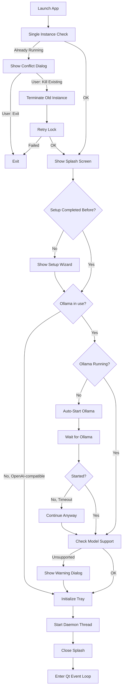
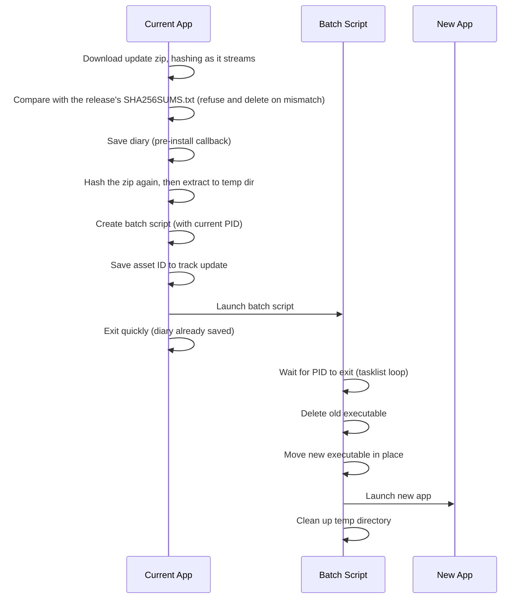

# Desktop App Specification

This document outlines the architecture and behavior of the Jarvis Desktop App - a cross-platform PyQt6 system tray application that provides a graphical interface for the Jarvis voice assistant.

## Overview

The desktop app is a **separate package** from the core `jarvis` module. It depends on `jarvis` for assistant functionality but `jarvis` has no knowledge of or dependency on the desktop app. This separation allows:

- Running Jarvis headless (CLI/daemon only)
- Building alternative UIs (web, mobile) without modifying core logic
- Keeping PyQt6 dependencies isolated from the core package

The direction is one-way and checked: `tests/test_jarvis_does_not_import_desktop_app.py` parses every module under `src/jarvis` and fails on any import of `desktop_app`, including one inside a function. What both sides need belongs to `jarvis`, and the desktop app imports it from there. The assistant's state (what it is doing right now) is the standing example: it lives in `src/jarvis/state.py` (see `src/jarvis/state.spec.md`), the voice pipeline publishes it, and the desktop app only reads it.

## Package Structure

```
src/desktop_app/
├── __init__.py          # Re-exports main() as the entry point
├── app.py               # JarvisSystemTray, windows, startup flow
├── splash_screen.py     # Animated startup splash
├── setup_wizard.py      # First-run setup wizard
├── settings_window.py   # Auto-generated settings UI from config metadata
├── face_widget.py       # Animated face that follows the assistant's state
├── orb/                 # State-driven orb window and widget (see Orb below)
├── themes.py            # Qt stylesheets and color palette
├── diary_dialog.py      # End-of-session diary update dialog
├── chat_window.py       # Text chat interface (see chat_window.spec.md)
├── memory_viewer.py     # Flask-based memory browser
├── dashboard/           # The dashboard window's bridge and page (the page ships as data, see Packaging)
├── updater.py           # Update checking logic
├── update_dialog.py     # Update notification dialogs
└── desktop_assets/      # Icons and images
```

## Startup Flow

The startup sequence ensures a smooth user experience even when dependencies (like Ollama) aren't ready.



### Key Startup Features

1. **Splash Screen**: Shows immediately to provide visual feedback while loading. It stays hidden throughout the unreachable-server warning and any setup wizard opened from that warning, then resumes when startup continues (whether the wizard is accepted or cancelled).
2. **Provider-aware Ollama gating** (`_ollama_runtime_flags` in `app.py`): The Ollama server-start and model-verification steps run only when a local provider actually uses Ollama. A pure OpenAI-compatible setup (chat and embeddings both remote) skips them entirely. `get_required_models()` is provider-aware, so model verification pulls exactly the models that run locally: chat + intent-judge when chat is on Ollama, and the embedding model when embeddings are on Ollama. When chat is on Ollama, a missing model opens the setup wizard; when only embeddings are local (remote chat), a missing embedding model surfaces a clear non-blocking instruction (memory search falls back to keyword matching until it is pulled). The unsupported-chat-model check runs only on the Ollama chat path. `should_show_setup_wizard()` returns False for an OpenAI-compatible chat provider.
3. **Ollama Auto-Start**: When Ollama is in use and not running, automatically starts it (up to 15s wait). The desktop app records ownership only for an Ollama runtime it launches in this session. On app exit, it stops that owned runtime and leaves any pre-existing user-managed Ollama process running.
3a. **OpenAI-compatible reachability check** (`_check_openai_compat_reachable` in `app.py`): Jarvis cannot start a third-party server the way it starts Ollama, so on a pure OpenAI-compatible setup it checks the server answers `GET /v1/models` and, if not, shows a one-off warning naming the address (never the API key) and pointing to Settings, then continues. The user only otherwise discovers a down server when their first request fails.
4. **Single Instance Lock**: Prevents multiple copies from running simultaneously. If another instance is detected, shows a dialog offering to close the existing instance and start fresh.
5. **Crash Detection**: Detects previous crashes and offers to submit bug reports

## Main Components

### JarvisSystemTray

The central controller that manages:

- **System tray icon** with context menu
- **Daemon lifecycle** (start/stop the Jarvis voice assistant)
- **Window management** (log viewer, memory viewer, face window)
- **Update checking** on startup (switchable off with `update_check_enabled`) and on-demand
- **Runtime diagnostics** (`🩺 Runtime Status`): shows whether the assistant is listening, the daemon mode/PID, whether Low Power Mode is active, whether Ollama is needed/running, whether Jarvis owns the current Ollama runtime, active chat/embedding models, and configured MCP server count. The dialog is informational and never starts or stops services.
- **Fast stop** (`⚡ Stop Now (Skip Diary)`): available only while the daemon is running. It stops the voice daemon without the final shutdown diary LLM pass so local model resources are released quickly. Normal `⏸️ Stop Listening` still performs the shutdown diary save.

### Windows

| Window | Purpose |
|--------|---------|
| **LogViewerWindow** | Real-time log output from the daemon, with "Report Issue" button |
| **MemoryViewerWindow** | Web-based memory browser (Flask server) |
| **FaceWindow** | Animated face that follows the assistant's state (idle, listening, thinking, speaking, dictating) |
| **SettingsWindow** | Auto-generated config editor with tabbed categories |
| **SetupWizard** | First-run configuration (Ollama, models, profile) |
| **DictationHistoryWindow** | Scrollable list of past dictations with copy/delete/clear actions |
| **ChatWindow** | Text chat interface alongside voice; shares one conversation with the voice path and is enabled only while the daemon is running (see `chat_window.spec.md`) |
| **DashboardWindow** | The HUD dashboard: a web page driven over a `QWebChannel`, and the window the app starts with (see Dashboard below) |
| **OrbWindow** | Frameless, translucent, always-on-top orb driven by the assistant's state; toggled from the tray or with `Ctrl+Shift+J` (`Cmd+Shift+J` on macOS) |

### Dashboard

`DashboardWindow` (`dashboard_window.py`) hosts the HUD page `dashboard/index.html` in a `QWebEngineView`. `DashboardBridge` (`dashboard/bridge.py`) is registered on a `QWebChannel` as `window.jarvis` and carries everything the page shows: system stats, the voice state (orb accent and status line), the weather when location is enabled, and the chat. The window is created lazily and is what the app opens at startup; the tray's `🖥️ Dashboard` action raises it.

**Where it can be shown.** A web view needs QtWebEngine, and QtWebEngine crashes the app the moment a view is shown inside a frozen macOS bundle. The memory viewer falls back to the system browser there; the dashboard cannot, because its channel to the bridge exists only inside this process. `_dashboard_available()` is therefore false without WebEngine and in a frozen macOS build. In that case the tray has no `🖥️ Dashboard` action, `show_dashboard()` does nothing, and the app starts with the floating orb instead.

**Chat.** The page's `submitQuery` reaches the daemon through a submit hook that the tray wires when a daemon starts, clears when it stops or dies, and pushes to the window on every lifecycle change (`_set_chat_daemon_status`), so a dashboard opened before the daemon starts and one opened after it behave the same. With no hook wired the bridge answers with a local preview line and nothing is sent. The route depends on where the daemon runs:

- **Subprocess mode**: the hook writes a `__CHAT_QUERY__:` line to the daemon's stdin. The daemon's `__CHAT__:` lines come back through `_on_chat_ipc_line`, which feeds the dashboard as well as the chat window.
- **Bundled mode**: the hook calls `jarvis.daemon.submit_text_query` with `on_start`, `on_token`, `on_stage`, `on_complete` and `on_busy`. The daemon calls back from its worker thread, so each event is rewritten as the `__CHAT__:` line the subprocess bus would have carried and emitted through a `ChatIpcSignals`, which queues it onto the Qt main thread; the dashboard then parses it as it parses a subprocess line. These events reach the dashboard alone. The chat window keeps calling the daemon with its own callbacks, and a reply it had also been handed as an event would show twice once it seeds its transcript from the dialogue memory on first show. The two windows share the daemon's one dialogue memory, not each other's transcript.

Nothing on this route logs the query text: the `start` event carries the redacted query, and the debug lines name no message.

### Orb

`src/desktop_app/orb/` renders an icosphere whose colour, intensity and surface motion follow the assistant's state (`OrbState`: IDLE deep blue `#1a3a5c`, LISTENING cyan `#00d4ff`, THINKING amber `#ff9500`, SPEAKING warm white `#e8f4ff`, plus a transient ERROR overlay in red `#ff3838`), eased through `StateController` with a 250 ms minimum cubic transition; the ERROR overlay fades over 800 ms and returns on its own to the state that was active before it. It draws with QPainter at 60 FPS: a stack of four halos, the shaded body, the wireframe displaced by two octaves of deterministic pseudo-noise so the surface breathes, a red and a blue rim in the active states, particles orbiting on the clock (`ui.orb_particles_enabled`), and a key-light highlight.

The orb listens to nothing. It has no audio input, takes no audio source as an argument, and the package exposes no audio API: a frame is a function of state and time only, so the orb renders the same whether the daemon runs in the same process, in a subprocess, or not at all. The widget renders only while it is on screen (`pause_rendering` / `resume_rendering`), and its clock restarts on resume so a transition in flight never jumps.

Two hosts embed it. `OrbWindow` is the floating instance: frameless, translucent, always on top and draggable; built at startup with a provider that reads the shared `JarvisState` (see Assistant State below), shown at launch only when the dashboard is unavailable (see Dashboard; the dashboard draws its own canvas orb from the same state), and otherwise toggled from the tray action `🟠 Toggle Orb` or the hotkey `Ctrl+Shift+J` (`Cmd+Shift+J` on macOS: a global pynput hotkey, disabled on macOS 26+ where pynput crashes the process, and a window-scoped Qt shortcut that works while the orb has focus). Hiding the window pauses the widget; showing it resumes it. `ChatWindow` embeds its own instance in the introductory panel that only an empty conversation shows, drives it through `set_state` (THINKING while a query is in flight, IDLE otherwise), pauses it the moment a message lands or the window hides, and resumes it when the window shows with an empty transcript (see `chat_window.spec.md`).

### Assistant State

The orb, the dashboard and the face show what the assistant is doing by reading the shared `JarvisState` through `get_jarvis_state()`, both defined in `src/jarvis/state.py` and imported from `jarvis` (`src/jarvis/state.spec.md` owns the contract: the values, who publishes each, and the file that carries it between processes). The desktop app reads it by polling and never subscribes, because the daemon publishes from its own threads, and from another process in a development checkout.

- The floating orb's `StateController` polls a provider each frame.
- The dashboard bridge polls at 5 Hz and maps the value to the HUD orb's accent and label.
- The face polls each frame.

The desktop app publishes one value itself: `ASLEEP`, when the daemon stops and while the setup wizard is open, so nothing looks ready while nothing is listening. It defines no state of its own.

### Tray Menu: GPU Library Recovery (Windows)

`cuda_recovery.py` exposes the `🎮 Reinstall GPU libraries` action. The tray adds it only when running on Windows, an NVIDIA driver is detected (`%SystemRoot%\System32\nvcuda.dll` exists), and the bundled `install_cuda.ps1` script is on disk. Clicking it confirms with the user, then re-runs `install_cuda.ps1` via `ShellExecuteW` with the `runas` verb so UAC elevates the process before it writes into `Program Files\Jarvis\cuda`. This is the only user-facing recovery path when the original Inno Setup install of cuBLAS/cuDNN fails — the installer's own task fires once per install and the script's marker file used to make subsequent reinstalls skip the CUDA step. The runtime probe in `jarvis.listening.listener._print_cuda_unavailable_hint` points users at this action by name when it falls back to CPU.

The Inno Setup script also runs a `VerifyCudaInstall` hook after the CUDA download task completes. The hook checks for the `.cuda_installed` marker (which `install_cuda.ps1` only writes after every expected DLL is present and SHA-verified) and surfaces a `MsgBox` pointing at `{app}\cuda\install.log` and the tray recovery action when the marker is missing. This is what makes a hidden install failure visible to the user instead of letting the installer report success on a half-installed CUDA tree.

### DictationHistoryWindow Behaviour

- **Backing store**: File-backed via `DictationHistory` (`src/jarvis/dictation/history.py`); entries are newest-first with `id`, `text`, `timestamp`, `duration`. Disk is the source of truth — the window must not assume its in-memory instance is authoritative.
- **Hidden windows are inert**: Signals from the dictation engine must not mutate the widget tree while the window is hidden; pending entries are surfaced on next open instead. The engine persists entries regardless, so no data is lost.
- **On show, reload from disk and rebuild**: The window reads disk state on every show, because the daemon may be in a separate process (subprocess mode) or may have recorded entries while the window was hidden (bundled mode). In-memory state alone is not trusted.
- **While visible, poll for external writes**: A short interval timer watches the history file's mtime and reloads on change so subprocess-mode dictations appear without requiring a re-open.
- **Rebuilds replace the container**: `_reload()` builds a fresh list container and installs it into the scroll area via `takeWidget()` + `setWidget()`; the previous container is hidden and `deleteLater()`'d. This atomic swap sidesteps every class of orphan-during-paint issue that surgical layout edits invite.
- **Reload deferred off showEvent**: `showEvent` schedules the rebuild via `QTimer.singleShot(0, ...)` rather than mutating the widget tree inline, so the first paint pass sees a stable tree.
- **No emoji codepoints in `strftime` format strings**: On Windows with the bundled Python 3.11, `datetime.strftime` routes through the C locale encoder and raises `UnicodeEncodeError` on non-BMP codepoints (e.g. 📅). When that exception escapes a Qt slot invocation, Qt6Core triggers a fast-fail (0xc0000409) and the whole app dies. Build timestamp labels by interpolating emoji outside `strftime`.

### LogViewerWindow Features

- Real-time log streaming from daemon
- Monospace font for readability (JetBrains Mono on macOS, Consolas elsewhere)
- **Report Issue button**: Opens GitHub issue with:
  - Pre-filled bug report template
  - Auto-redacted log contents (emails, tokens, JWTs, passwords, etc.)
  - Logs in collapsible `<details>` section
  - Version and platform info
  - Log truncation preserves the init section (everything up to the last `─`×50 separator) + recent tail (most useful for debugging); middle lines are truncated
  - Targets `GITHUB_REPO`, the repository the updater reads releases from; `_new_issue_url` builds the URL for this button and for the crash dialog, so a report and an update check always address the same project

### Splash Screen

Animated loading screen shown during startup with:

- Pulsing orb animation (matches theme colors)
- Status text updates ("Checking Ollama...", "Starting daemon...")
- Frameless, centered, always-on-top

## Daemon Integration

The desktop app runs the Jarvis daemon in a **QThread** (bundled mode) or **subprocess** (development mode).

```
┌─────────────────────────────────────────┐
│           Desktop App (Main Thread)      │
│  ┌─────────────────────────────────┐    │
│  │         Qt Event Loop            │    │
│  │  - Tray icon interactions        │    │
│  │  - Window management             │    │
│  │  - Signal/slot communication     │    │
│  └─────────────────────────────────┘    │
│                   │                      │
│                   │ signals              │
│                   ▼                      │
│  ┌─────────────────────────────────┐    │
│  │      DaemonThread (QThread)      │    │
│  │  - Runs jarvis.daemon.main()     │    │
│  │  - Captures stdout/stderr        │    │
│  │  - Emits logs to LogViewer       │    │
│  └─────────────────────────────────┘    │
└─────────────────────────────────────────┘
```

### Daemon Callbacks

The desktop app registers callbacks with the daemon for:

- **Diary updates**: Shows DiaryUpdateDialog when session ends
- **Clean shutdown**: Ensures graceful exit with diary save
- **Fast shutdown**: Calls `request_stop(skip_diary_update=True)` in bundled mode, or sends `SHUTDOWN_SKIP_DIARY` over daemon stdin in subprocess mode. This skips only the final forced diary update; dictation, voice, TTS, MCP runtime, and database cleanup still run.

#### Bundled Mode (QThread)

In bundled mode, the daemon runs in the same process, so callbacks can be set directly via `set_diary_update_callbacks()`. The DiaryUpdateDialog receives:
- `on_chunks`: List of conversation chunks being summarized
- `on_token`: Streaming tokens as the diary is generated
- `on_status`: Status messages ("Writing diary entry...")
- `on_complete`: Completion signal (success/failure)

Chat has no stdout bus in this mode: the chat window and the dashboard each call `jarvis.daemon.submit_text_query` directly (see Dashboard for the dashboard's route). Cancellation and rewind are direct calls too.

#### Subprocess Mode (Development)

In subprocess mode, the daemon runs as a separate process. IPC is achieved via stdout:
- **Diary updates**: Daemon emits JSON events prefixed with `__DIARY__:` (e.g., `__DIARY__:{"type":"token","data":"Hello"}`)
- **Chat events**: Daemon emits `__CHAT__:` events (start/token/stage/complete/busy, the confirmation events, the rewind verdicts); the desktop app writes queries, cancellations, rewinds and confirmation decisions to the daemon's stdin as `__CHAT_QUERY__:`, `__CHAT_CANCEL__`, `__CHAT_REWIND__:` and `__CHAT_DECISION__:` lines (see `chat_window.spec.md`). Chat lines never reach the log viewer, in either mode.
- Desktop app intercepts these lines from the log stream
- DiaryUpdateDialog's `process_log_line()` parses and emits signals
- Chat IPC lines are marshalled onto the Qt main thread via `ChatIpcSignals`, then `_on_chat_ipc_line()` forwards them to `ChatWindow.process_ipc_line()` and, when it is open, to `DashboardWindow.process_ipc_line()`
- When the daemon starts, stops, or a subprocess exits unexpectedly, the tray updates any open ChatWindow lifecycle banner and clears or refreshes its stdin hooks (submit, cancel, control), the dashboard's submit hook and the confirmation decision writer together, so no window writes to a dead pipe.
- Same UI experience as bundled mode

## Theme System

All UI components use a consistent dark theme defined in `themes.py`:

```python
COLORS = {
    "bg_primary": "#09090b",      # Deep space black
    "bg_secondary": "#18181b",    # Slightly lighter
    "accent_primary": "#f59e0b",  # Amber
    "accent_secondary": "#fbbf24", # Lighter amber
    "text_primary": "#fafafa",    # White
    "text_secondary": "#a1a1aa",  # Muted
    ...
}
```

Components use `JARVIS_THEME_STYLESHEET` for consistent styling across all dialogs and windows.

## Update System

The desktop app includes an auto-update mechanism:

1. **Check**: Queries the GitHub releases API of `GITHUB_REPO` (`updater.py`) for newer versions
2. **Notify**: Shows dialog with changelog and download option
3. **Download**: Downloads new installer with progress bar and verifies it against the release's checksum file (see "Integrity of what is installed")
4. **Install**: Platform-specific installation (see below)

Updates are only available in bundled mode (PyInstaller builds).

### Automatic check and its opt-out

Five seconds after launch the tray runs one check by itself. The `update_check_enabled` setting (default `true`; Settings, Features, "Check for Updates at Startup") switches it off: the check then returns without sending a request, so the app sends no update check on its own. The setting governs the update check and nothing else: weather, speech-model and voice downloads are other features with their own triggers. A check the user asks for with the tray's "Check for Updates" action is theirs and always goes out, whatever the setting says. An unreadable setting counts as off.

The check lists the releases of `Hocsman/jarvis` on `api.github.com` and sends no identifier of the user or of the install. Downloads come from the asset URLs that listing returns.

### Integrity of what is installed

Every release publishes a `SHA256SUMS.txt` next to its installers, in the format `sha256sum` writes (`<64 hex digits>  <file name>`, binary-mode `*` marker accepted). `scripts/release_checksums.sh` writes it from the built archives and both release jobs attach it. The updater runs nothing it has not verified against it:

- **Before the download**: the checksum file of the same release is fetched (10 s timeout, at most 64 KiB) and the line for the installer's asset name is read. The installer is hashed as it streams to disk, and `completed` is emitted only when its SHA-256 equals that line.
- **Before the install**: `install_update` hashes the archive again, immediately before extracting it, because it sat on disk while the session was saved. It takes the verified digest as an argument, so no caller can install without one.
- **Fail closed**: each of these refuses the update, tells the user in the progress dialog, writes the reason to the debug log and deletes the download: the release publishes no checksum file (nothing is downloaded); the file cannot be fetched, is not text, exceeds the size cap, lists the installer nowhere, or lists it with two different digests; the digest differs; the archive changed between download and install. The user can still update by hand from the release page.
- **What a refusal leaves running**: the session is saved, and the voice session stopped, only once the download has verified. Every refusal up to that point leaves the running session untouched. An archive that changes after that (the last case above) is caught by the second hash, which runs after the session has been saved and the voice session stopped; nothing is installed, and the user restarts listening.
- A client that downloads while the assets of the rolling `latest` release are being replaced sees a mismatch and refuses; retrying once the upload has finished succeeds.

What this proves and what it does not. The checksum file comes from the same release, over the same TLS connection to the same account, as the installer. It proves **integrity**: the bytes that run are the bytes the release lists, so a truncated or corrupted download, a proxy or cache altering one file, and an asset replaced without its checksum line are all caught. It does not prove **authenticity**: whoever can change a release (a compromised account, token or workflow) can change the installer and its checksum together, and the digest then matches. The trust root stays TLS to GitHub plus control of the `Hocsman/jarvis` releases. Authenticity needs a signature made with a key held outside GitHub (Authenticode on the Windows installer, Apple Developer ID notarisation, or a detached signature checked against a key pinned in the app). Builds are unsigned, and signing needs certificates or key custody this project does not have. The install remains the user's decision (the Update dialog) and the Windows installer asks for elevation.

### Release assets

A release is complete when it carries the installer of every platform (`Jarvis-Windows-x64.zip`, `Jarvis-macOS-arm64.zip`, `Jarvis-macOS-x64.zip`, `Jarvis-Linux-x64.tar.gz`) and `SHA256SUMS.txt`. The release workflow publishes a versioned release only after every platform has built, passed the bundle check and uploaded, and the rolling `latest` release is rewritten only under the same condition. The bundle check is `scripts/check_bundle_layout.py` run against the finished build: it reads the build, launches nothing, and fails when a file the app opens at runtime is missing. The updater ignores a release that lacks the installer for its platform and refuses one that lacks the checksum file.

### Platform-Specific Update Installation

| Platform | Strategy |
|----------|----------|
| **macOS** | Extracts the update zip with `ditto -x -k` (Python's `zipfile` drops the symlinks Qt/Qt WebEngine frameworks rely on, producing a bundle macOS refuses to launch with "Jarvis.app can't be opened"; the release workflow creates the zip with the matching `ditto -c -k --keepParent`). Falls back to `zipfile.extractall` only when `/usr/bin/ditto` is missing — i.e. unit tests on Linux CI; production macOS always ships ditto, so the fallback never runs in the field. Then creates a shell script that waits for the current process (by PID via `kill -0`) to exit, moves the old `.app` aside to `Jarvis.app.backup` (one-generation rollback), moves the new bundle in, strips `com.apple.quarantine` so Gatekeeper doesn't re-prompt on unsigned builds, re-registers the swapped bundle with `lsregister -f` (LaunchServices caches the old inode across the `mv` and a bare `open` silently no-ops otherwise), relaunches with `open -n`, and falls back to execing the bundle's inner binary via `nohup` if `open` fails. Script output is captured to `~/Library/Logs/Jarvis/updater.log` (size-capped) so detached failures leave a diagnostic trail. The executable name is read from the new bundle's `CFBundleExecutable`, not hardcoded. No Finder/AppleScript automation. Pattern mirrors Squirrel.Mac's `ShipIt` helper. |
| **Windows** | Creates a batch script that waits for the current process (by PID via `tasklist`) to exit, then runs the Inno Setup installer with `/SILENT` so the installer's own progress window provides visual feedback during install, then relaunches the upgraded exe. Rollback is handled by Inno Setup's own in-session rollback + retained uninstaller data. |
| **Linux** | Creates a shell script that waits for the current process (by PID via `kill -0`) to exit, moves the old directory to `Jarvis.backup` for rollback, moves the new directory in, and relaunches |

### Update Flow (Windows/Linux)



### Important Notes

- **Diary is saved before update installation**: The `pre_install_callback` mechanism ensures the diary is saved before the update process begins, so no data is lost
- **Develop channel commit tracking**: Develop channel builds track updates by comparing commit hashes (extracted from the build version and release commit metadata or body), falling back to GitHub asset ID when commit metadata is unavailable
- **Robust Windows update**: The batch script waits for the actual process to exit (by PID) rather than using a fixed timeout, ensuring the update doesn't fail due to slow shutdown
- **Visible Windows install progress**: The Inno Setup installer runs with `/SILENT` (not `/VERYSILENT`) so its own progress window is visible while the install runs — bridging the gap between the download dialog closing and the new app launching, which would otherwise look like a hang
- **Quarantine stripping (macOS)**: The shell script runs `xattr -dr com.apple.quarantine` on the newly-installed bundle. Builds are unsigned (ad-hoc signing breaks Qt WebEngine's symlinks — see `release.yml`), so without this step Gatekeeper may re-trigger the "unidentified developer" prompt on every update
- **One-generation rollback (macOS, Linux)**: The previous `.app` / directory is moved aside to `<name>.backup` rather than deleted outright, so a user can restore the prior version manually if the new one fails to launch. The backup from the previous update is cleared before creating a new one, so at most one backup exists on disk at a time. This is a simplified version of Squirrel's versioned-folder rollback — enough safety for a single-bundle install, without the architectural overhead

## Packaging

The desktop app ships as a PyInstaller build described by `jarvis_desktop.spec`: a onedir folder on Windows and Linux (`dist/Jarvis/Jarvis.exe` or `dist/Jarvis/Jarvis`, next to an `_internal` folder that holds the data files), and a `Jarvis.app` bundle on macOS. Windows wraps the folder in an Inno Setup installer (`installer/windows/jarvis_setup.iss`).

### Data files

PyInstaller follows imports and nothing else, so every file the app opens through `Path(__file__)` is listed in the spec's `datas`. A module inside a package resolves such a file against its package folder, so the file lands at the path it has under `src/`. Today that is the dashboard page (`desktop_app/dashboard/index.html`, opened by `dashboard_window.py`) and the tray icons (`desktop_app/desktop_assets/*.png`). Python modules are never listed as data, they reach the build through import analysis. The `.ico` icons are embedded in the executable at build time and are not data.

The entry script is the one module that does not resolve against its package folder: PyInstaller places it at the root of the data tree, so its `Path(__file__).parent` is that root (`_internal` in a onedir build) and not `desktop_app/`. `app.py` is the entry script, and its tray-icon lookup (`get_icon_path`) builds `desktop_assets/<icon>` from that parent. In a frozen build it therefore looks for the icons next to the root, while they ship under `desktop_app/desktop_assets`, and the tray shows its drawn fallback icon. A lookup that resolves against the package folder (`sys._MEIPASS/desktop_app` when frozen) finds them where they ship.

The rule is enforced from the tree, not from a list kept by hand. `tests/test_pyinstaller_spec.py` runs the spec once per platform with PyInstaller's names stubbed, expands `datas` the way PyInstaller does, and fails when a runtime data file under `src/` is not bundled or lands somewhere else than the mirror of its place in the tree. That is the placement package modules look for; the check does not cover what the entry script opens itself. A file whose kind is unknown fails it too, until its suffix is classified in `scripts/check_bundle_layout.py`: guessing is how a file goes missing.

### Licence texts

`LICENSE` and `THIRD_PARTY_NOTICES.txt` ship at the top of the bundle's data tree on every platform. The Windows installer also copies both next to `Jarvis.exe`, and shows `LICENSE` on a wizard page before installing; a silent run, which is how the updater invokes it (`/SILENT`), skips the page.

`THIRD_PARTY_NOTICES.txt` is generated, not written by hand. `scripts/generate_third_party_notices.py` reads, offline, the licence each package declares in the metadata installed in the build environment. It covers the requirements the build bundles and the dependencies those declare. A requirement is bundled when the source or the spec's `hiddenimports` import it, unless the spec's `excludes` list it or the installer downloads it on request (the CUDA libraries); this is derived from the repository, not listed in the script. Packages that declare a GPL, LGPL or AGPL licence are marked as such, in an opening section and in their own entry. The file records what the metadata declares and makes no statement about how those licences relate to each other or to the project's `LICENSE`. It also records the platform and Python version it was generated on (`Generated on: ...`), because a build on another platform can carry other package versions, and a package installed for one platform only (`mlx-whisper`, macOS arm64) reads as not installed in an inventory generated elsewhere. It is regenerated, in the environment the build uses, whenever `requirements.txt` changes: `tests/test_third_party_notices.py` fails when a bundled requirement has no entry or a copyleft licence is not marked.

### Checking a build

`scripts/test_bundled_app.bat` and `scripts/test_bundled_app.sh` build, run `scripts/check_bundle_layout.py` on the result, and only then launch the app. The check looks for the executable the platform's build produces and for every runtime data file and licence text at the place the bundle's layout gives it (`_internal` on Windows and Linux, `Contents/Resources` or `Contents/Frameworks` on macOS), and names each one that is missing. The Windows batch file asks for plain ASCII output.

## Memory Viewer

A Flask-based web interface for browsing what the assistant holds:

- Runs on `localhost:5050`
- **Bundled mode**: Flask runs in a daemon thread
- **Development mode**: Flask runs as subprocess
- Opens in embedded QWebEngineView or system browser (macOS fallback)
- **Local-only gate**: the server answers only the `localhost` / `127.0.0.1` Host names, refuses a write whose Origin is present and not its own, and requires a per-launch token on every mutating request — the server mints it, embeds it in a `<meta>` tag of the page it serves, and the page's script reads it from there and sends it back as `X-Jarvis-Token`; the four bulk sweeps additionally require `application/json`, a shape no HTML form produces. Reads carry no token, except the read that writes: viewing a node increments its access score (the graph spec asks for it on a UI view), so `GET /api/graph/node/<id>` requires the token like a write, and a drive-by subresource GET from a foreign site cannot move the score. The other reads have no side effects (the ledger's 90-day prune runs at daemon startup and on the reminder scheduler's tick, not in the Activity GET), their integer query parameters are clamped to their range with a default on garbage (a negative SQLite LIMIT means "no limit"), and the sweep progress renderers escape every server-provided string they interpolate: node names are extracted from diary content and must arrive as text, never as markup. Every response, refusals included, carries `X-Frame-Options: DENY`, `frame-ancestors 'none'`, `X-Content-Type-Options: nosniff`, `no-store` and the content security policy described below: the token-bearing page is never framed by a foreign site (a clickjacked genuine page would be same-origin and tokened) and never served from a cache (a stale page wields a dead token). A listener already holding the port must identify itself via `/api/health` before the window is pointed at it; the probe talks to loopback directly, with no proxy, no redirect following and a capped read. Every refusal is logged
- **No remote content**: the page the viewer serves references no remote URL — fonts come from system stacks (a `system-ui` sans stack, a `ui-monospace` monospace stack) and the only stylesheet is the inline one — so opening the window never contacts a third party. The embedded WebEngine view backs the promise from its side: the installed page refuses every navigation to a host other than `localhost` / `127.0.0.1` / `::1` (Qt's internal `about:` states and `setHtml`'s self-contained `data:` document are the only exceptions) and logs the refusal. Subresource requests do not pass through the navigation guard; the served page's freedom from remote references covers that side, and the content security policy refuses any remote load the page might one day attempt (no directive names an origin other than the viewer's own).
- **Structurally hard to inject into**: the page holds the launch token, so script running inside it could write the user's memory files. Escaping every server-provided string keeps markup out of the page; the content security policy is the layer that still holds on the day an escape is missed. The page runs one script, served from its own `/viewer.js` route (a read, so it holds no secret: the token rides in the page's `<meta>` tag), and carries no inline script and no event-handler attribute. The policy admits scripts from the viewer's own origin only (`script-src 'self'`, with no `'unsafe-inline'` and no `'unsafe-eval'`), refuses every other kind of load that is not named (`default-src 'none'`, `connect-src 'self'`), and forbids rebasing the page or posting a form elsewhere (`base-uri 'none'`, `form-action 'none'`). Styles keep `'unsafe-inline'` because the page sets them in attributes. Markup that slips past an escape therefore renders as inert elements: an `onerror` attribute, a `javascript:` URL and an injected `<script>` are all refused by the browser. Two rules in the script keep it that way:
  - No handler is ever a string in the markup. Every click on markup the script builds goes through one route: the control carries a `data-action` name, which one delegated listener looks up among the handlers the script registered with `registerAction` (the topic tags, the delete buttons of memories and meals, the buttons of the Rappels, Routines, Appris and Objectifs tabs, the knowledge tree's nodes and arrows, the node details panel, the Core tab's file buttons, and every button of every modal take this route). A click on a modal's backdrop takes it too: the overlay is built by one helper that stamps `data-backdrop-dismiss` on it, and the same listener closes it when the click lands on the overlay itself, not on anything inside it, unless the modal's work is in flight (`data-busy`). Only the page's own static controls (the tabs, the search box and date inputs, the maintenance, Activity, Rappels form and graph toolbar buttons, the canvas) listen for themselves, wired once at boot. What a handler acts on, a node id or any other value, reaches it through the `dataset` of the element or of one that encloses it (a modal's parent node id sits on the overlay), never through a handler string.
  - A value the server supplied (an id, a path, a name, the user's own sentence) reaches an attribute through the DOM (`dataset`, `title`, `value`, a class toggle), never by being spliced into a template literal. Text positions go through the one quote-aware `escapeHtml`.

  `tests/test_memory_viewer_csp.py` pins the policy, the absence of inline script and handler attributes, that every `data-action` in the page or the script has a registered handler (and every registered handler is used), that the script's click listeners are the delegated one plus an explicit allowlist of the page's static controls (a per-element click listener on markup the script builds is a failing test), that every modal overlay is built by the one helper that stamps the backdrop attribute the delegated listener closes on, and that no value is spliced into an attribute.

Four tabs: **Diary** (conversation summaries), **Core**, **Knowledge** (the graph), **Meals**.

The Core tab is the surface for the user's own memory files (see `src/jarvis/memory/core.spec.md`). Each file shows its entries as the assistant reads them, retired ones struck through with the date and reason still legible, and its path so it can be found outside the app. Editing swaps to the raw Markdown and saves it back byte for byte: the file belongs to the user, and an editor that reformats what they typed, or drops a line its parser did not recognise, is one they stop trusting with the thing it holds.

The Knowledge tab hides the `user` and `directives` branches once they are empty. The core took them over, so a tab whose contents reach replies must not invite corrections to a line nothing consults. They stay visible while they still hold text, which is the window before the daemon next starts and hands it over.

## Error Handling

### Crash Detection

1. On startup, creates a `.crash_marker` file
2. On clean exit, removes the marker
3. On next startup, if marker exists → previous session crashed
4. Offers to submit crash report to the issue tracker of `GITHUB_REPO`

### Fallbacks

- **No Ollama**: Shows setup wizard or auto-starts
- **No WebEngine**: Opens memory viewer in system browser, and the floating orb replaces the dashboard
- **Model not supported**: Warning dialog with option to change
- **Update failed**: Error dialog with details

## Platform-Specific Behavior

| Feature | macOS | Windows | Linux |
|---------|-------|---------|-------|
| Tray icon | Native menu bar | System tray | System tray |
| Ollama start | `open -a Ollama` | `ollama serve` (hidden) | `ollama serve` |
| Crash logs | `~/Library/Logs/Jarvis` | `%LOCALAPPDATA%\Jarvis` | `~/.jarvis` |
| Memory viewer | System browser* | Embedded WebEngine | Embedded WebEngine |
| Dashboard | Floating orb instead* | Embedded WebEngine | Embedded WebEngine |

*macOS bundled apps cannot show a QtWebEngine view (sandbox issues): the memory viewer opens in the system browser and the floating orb replaces the dashboard.

### Qt on Windows

Windows holds Qt at the release the suite is green on, because later releases fail to load `Qt6Core.dll` (loader status `0xc0000139`); the other platforms take the newest. The pin moves on evidence: `scripts/check_qt_pin.py` imports `QtCore`, `QtWidgets`, `QtSvg` and `QtWebEngineWidgets` of a candidate install in a child process each (a loader failure can end the process that triggers it, and one module failing must not hide the others), prints the runtime Qt and PyQt versions, exits non-zero if any module fails, and names the loader failure with what to try next. The procedure (when to re-test, what to run, what to update) sits beside the pin in `requirements.txt`.

## File Locations

| File | macOS | Windows | Linux |
|------|-------|---------|-------|
| Config | `~/.config/jarvis/` | `%USERPROFILE%\.config\jarvis\` | `~/.config/jarvis/` |
| Database | `~/.local/share/jarvis/` | `%USERPROFILE%\.local\share\jarvis\` | `~/.local/share/jarvis/` |
| Crash logs | `~/Library/Logs/Jarvis/` | `%LOCALAPPDATA%\Jarvis\` | `~/.jarvis/` |
| Instance lock | `~/Library/Application Support/Jarvis/` | `%LOCALAPPDATA%\Jarvis\` | `~/.jarvis/` |
